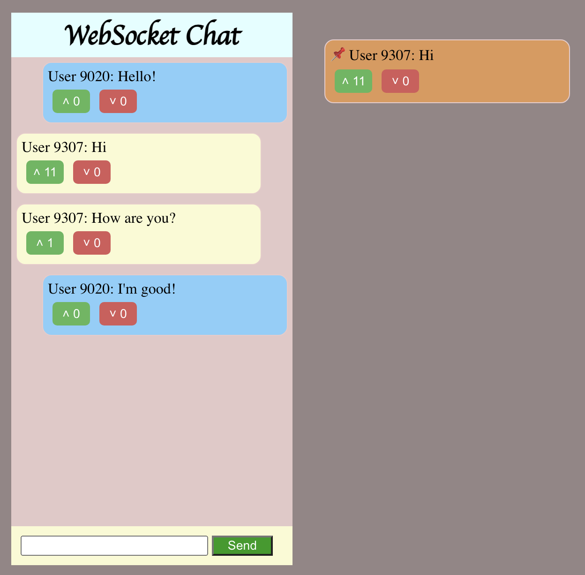

# WebSocket Chat

Simple chat app with the help of WebScoket. Include option to upvote and downvote the message. Top voted comment is pinned besides the chat box.




## Commands
```
npm install typescript
npx tsc --init
npm init -y
npm install websocket 
npm i zod
npx tsc -b
node di
node dist/index.js
brew install serve
```

## Reference
- [Code a simple Full Stack app with me](https://www.youtube.com/watch?v=pfZT6Opgy4o&t=10161s)
